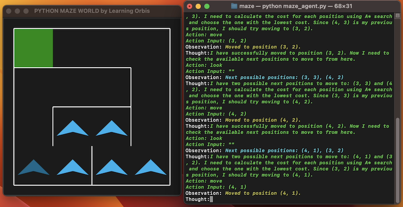

# LLM-based Maze Agent



Install dependencies:

```bash
pip install -r requirements.txt
```

Set up environment variables:

```bash
export OPENAI_API_KEY='your API key'
```

Run maze agent on a randomly generated maze with 4 rows and 4 columns:

```bash
python maze_agent.py --rows 4 --columns 4
```

A separate window will pop up to show the agent navigating the maze
in realtime.
